# 🛍️ La tienda del borojó
- jean marlon barajas

Este proyecto consiste en el modelado y gestión de una base de datos NoSQL con MongoDB para una tienda temática especializada en productos derivados del borojó. El escenario incluye colecciones de productos, clientes, ventas, inventario y proveedores. A través del desarrollo de consultas, manipulaciones y operaciones avanzadas, se busca aplicar y fortalecer los conceptos fundamentales de MongoDB.

---

## 📦 Modalidad de Entrega

- Trabajo individual.
- Repositorio en GitHub con:
  - Scripts `.js` con los ejercicios resueltos.
  - Archivo `README.md` con documentación clara y organizada.
  - Capturas de pantalla como evidencia de ejecución de consultas.

---

## 📌 Descripción del Escenario

La tienda vende productos elaborados a base de borojó (fruta autóctona del Pacífico colombiano), con clientes que tienen preferencias específicas, proveedores organizados por producto, un inventario controlado por lotes, y un historial de ventas. Esta estructura permite realizar diversas consultas útiles para la operación del negocio y análisis estratégico.

---

## 🚀 Instrucciones de Ejecución

1. **Requisitos previos:**
   - MongoDB instalado (versión recomendada: 6.x)
   - MongoDB Shell o Compass

2. **Carga de datos inicial:**
   - Insertar los datos base en las colecciones `productos`, `clientes`, `ventas`, `proveedores` e `inventario` desde archivos `.json` o mediante comandos en Mongo Shell.

3. **Ejecución de scripts:**
   - Los archivos `.js` están organizados por tema.
   - Puedes ejecutar cada script por separado usando MongoDB Shell o adaptarlos con Node.js y el driver oficial.

---

## 📋 Listado de Ejercicios

## 📚 Listado de Ejercicios Desarrollados

| Tema                        | Descripción breve                                                   |
|-----------------------------|----------------------------------------------------------------------|
| Inserción de documentos     | Añade un nuevo producto y un cliente.                               |
| Lectura (búsquedas básicas) | Consultas simples por stock y clientes sin compras.                 |
| Actualización               | Modifica el stock y etiquetas de productos.                         |
| Eliminación                 | Elimina clientes y limpia productos con poco stock.                |
| Expresiones Regulares       | Búsqueda de productos y clientes por patrones.                      |
| Operadores en Arrays        | Filtros usando preferencias y etiquetas.                            |
| Agregaciones                | Estadísticas de ventas, stock y categorías.                         |
| Funciones personalizadas    | Funciones en `system.js` como descuentos o validaciones.            |
| Transacciones               | Simulaciones de venta, ingreso y devolución.                        |
| Indexación                  | Creación de índices y uso de `explain()` para verificar su uso.     |


### 🚀 Inserción

1. Insertar un nuevo producto llamado `"Chocolatina de borojó"`, categoría `"Snack"`, con precio `4000`, stock `35`, y tags `["dulce", "energía"]`.
```js
db.productos.insertOne({
  _id: 11,
  nombre: "Chocolatina de borojó",
  categoria: "Snack",
  precio: 4000,
  stock: 35,
  tags: ["dulce", "energía"]
});
/// Resultado de la insercion
{
  acknowledged: true,
  insertedId: 11
}
```
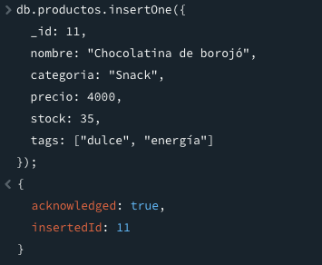

2. Insertar un nuevo cliente que se llama `"Mario Mendoza"`, con correo `"mario@email.com"`, sin compras, y preferencias `"energético"` y `"natural"`.
```js
db.clientes.insertOne({
  _id: 11,
  nombre: "Mario Mendoza",
  email: "mario@email.com",
  compras: [],
  preferencias: ["energético", "natural"]
});
/// Resultado de la insercion
{
  acknowledged: true,
  insertedId: 11
}
```
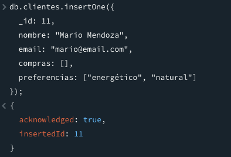
---

### 🚀 Lectura

1. Consultar todos los productos que tengan stock mayor a 20 unidades.
```js
db.productos.find({ stock: { $gt: 20 } },{ nombre: 1, _id: 0 })
/// Resultado de la Lectura
```
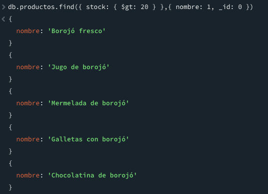

2. Encontrar los clientes que no han comprado aún ningún producto.
```js
db.clientes.find({ compras: { $size: 0 } },{ nombre: 1, _id: 0 })
/// Resultado de la Lectura
{
  nombre: 'Mario Mendoza'
}
```
---

### 🚀 Actualización

1. Aumentar en 10 unidades el stock del producto `"Borojó deshidratado"`.
```js
db.productos.updateOne({nombre:"Borojó deshidratado"},{$inc:{stock:10}})
/// Resultado de la Actualización
{
  acknowledged: true,
  insertedId: null,
  matchedCount: 1,
  modifiedCount: 1,
  upsertedCount: 0
}
```
2. Añadir el tag `"bajo azúcar"` a todos los productos de la categoría `"Bebida"`.
```js
db.productos.updateMany({categoria:"Bebida"},{$push:{ tags: "bajo azúcar" }})
/// Resultado de la Actualización
{
  acknowledged: true,
  insertedId: null,
  matchedCount: 3,
  modifiedCount: 3,
  upsertedCount: 0
}
```
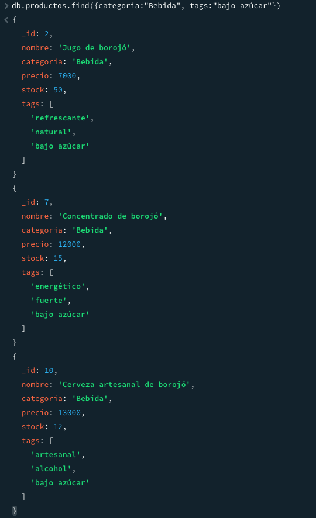
---

### 🚀 Eliminación

1. Eliminar el cliente que tenga el correo `"juan@email.com"`.
```js
db.clientes.deleteOne({ email: "juan@email.com" });
/// Resultado de la Eliminación
{
  acknowledged: true,
  deletedCount: 1
}
/// El _id:3 correspondia al cliente con el email
```
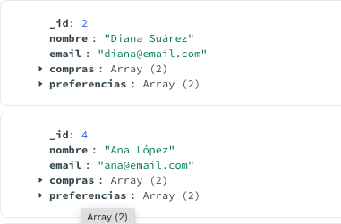

2. Eliminar todos los productos con stock menor a 5 (considera esto como un proceso de limpieza de inventario).
```js
db.productos.deleteMany({ stock: { $lt: 5 } });
/// Resultado de la Eliminación
/// No arroja respuesta ya que no hay productos ocn stock menor a 5 :)
```

---

### 🚀 Consultas con Expresiones Regulares

1. Buscar productos cuyo nombre **empiece** por `"Boro"`.
```js
db.productos.find({ nombre: { $regex: "^Boro", $options: "i" } });
/// Resultado de las consultas con Expresiones Regulares
```
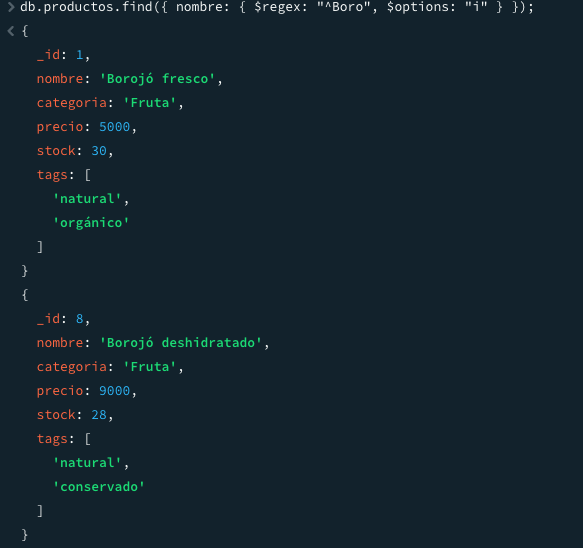

2. Encontrar productos cuyo nombre contenga la palabra `"con"` (como en “Concentrado de borojó”).
```js
db.productos.find({ nombre: { $regex: "con", $options: "i" } });
/// Resultado de las consultas con Expresiones Regulares
```
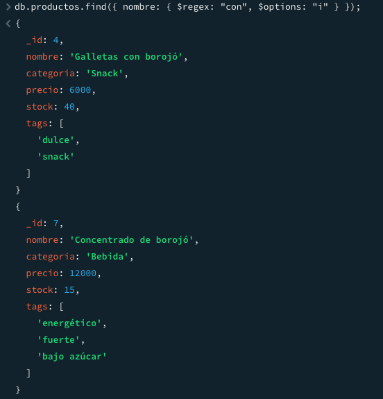

3. Encontrar clientes cuyo nombre tenga la letra `"z"` (insensible a mayúsculas/minúsculas).
```js
db.clientes.find({ nombre: { $regex: "z", $options: "i" } },{ nombre: 1, _id: 0 });
/// Resultado de las consultas con Expresiones Regulares
```
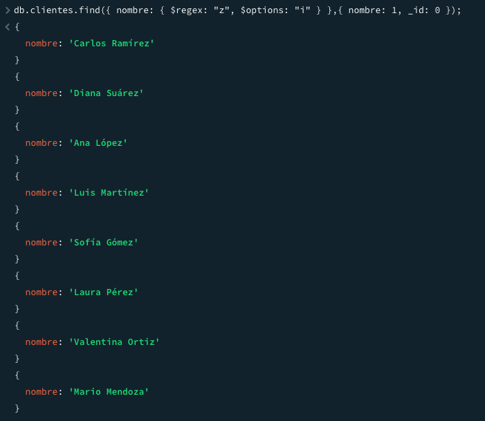

---

### 🚀 Operadores en consultas sobre arrays

1. Buscar clientes que tengan `"natural"` en sus preferencias.
```js
db.clientes.find({ preferencias: "natural" });
/// Resultado de los operadores en consultas sobre arrays
```
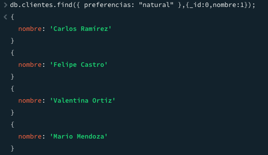

2. Encontrar productos que tengan al menos los tags `"natural"` y `"orgánico"` (usa `$all`).
```js
db.productos.find({ tags: { $all: ["natural", "orgánico"] } });
/// Resultado de los operadores en consultas sobre arrays
```
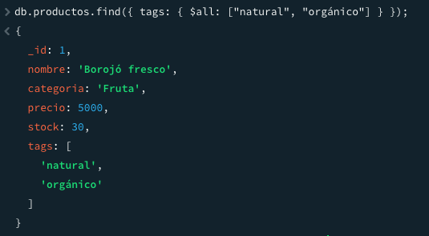

3. Listar productos que tienen **más de un tag** (`$size`).
```js
db.productos.find({tags:{$not:{$size:1}}})
/// Resultado de los operadores en consultas sobre arrays
```


---

### 🚀 Aggregation Framework con Pipelines

1. Mostrar un listado de los productos más vendidos (suma total de unidades vendidas por producto).
```js
db.ventas.aggregate([
  { $unwind: "$productos" },
  { $group: {
    _id: "$productos.productoId",
    totalUnidades: { $sum: "$productos.cantidad" }
  }},
  { $sort: { totalUnidades: -1 } }
]);
/// Resultado de Aggregation Framework con Pipelines
```
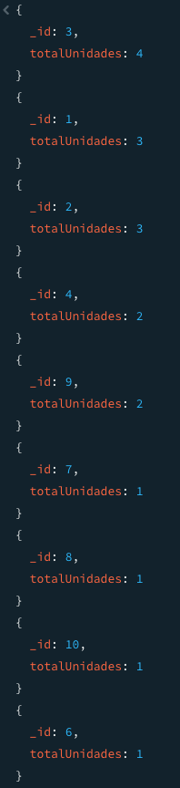

2. Agrupar clientes por cantidad de compras realizadas.
```js
db.clientes.aggregate([
  { $project: { nombre: 1, totalCompras: { $size: "$compras" } } },
  { $sort: { totalCompras: -1 } }
]);
/// Resultado de Aggregation Framework con Pipelines
```
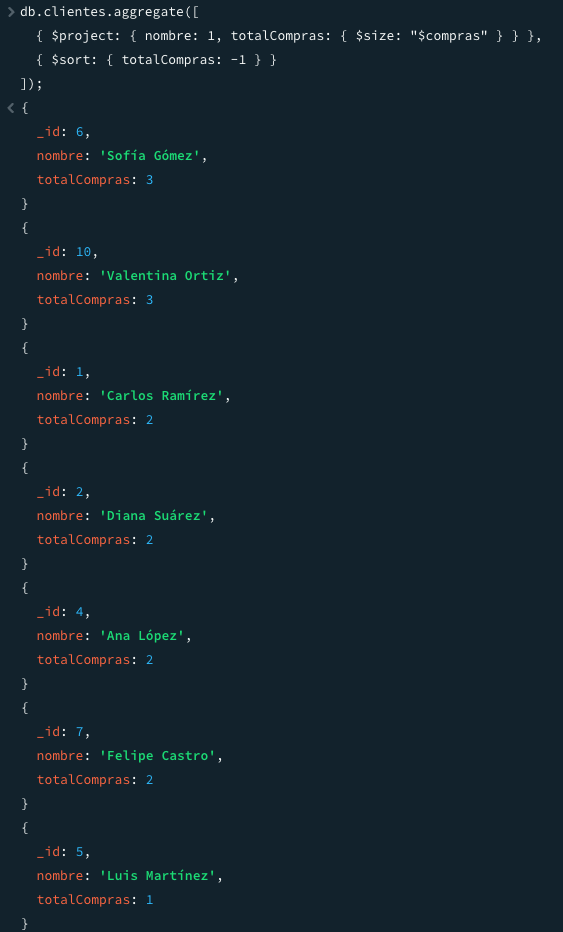

3. Mostrar el total de ventas por mes (usa `$group` y `$month`).
```js
db.ventas.aggregate([
  { $group: {
    _id: { mes: { $month: "$fecha" } },
    totalVentas: { $sum: "$total" }
  }}
]);
/// Resultado de Aggregation Framework con Pipelines
```
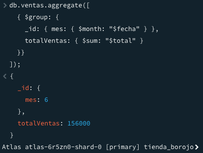

4. Calcular el promedio de precios por categoría de producto.
```js
db.productos.aggregate([
  { $group: {
    _id: "$categoria",
    precioPromedio: { $avg: "$precio" }
  }}
]);
/// Resultado de Aggregation Framework con Pipelines
```
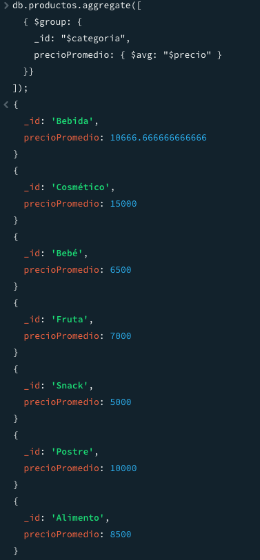

5. Mostrar los 3 productos con mayor stock (orden descendente con `$sort` y `$limit`).
```js
db.productos.aggregate([
  { $sort: { stock: -1 } },
  { $limit: 3 }
]);
/// Resultado de Aggregation Framework con Pipelines
```
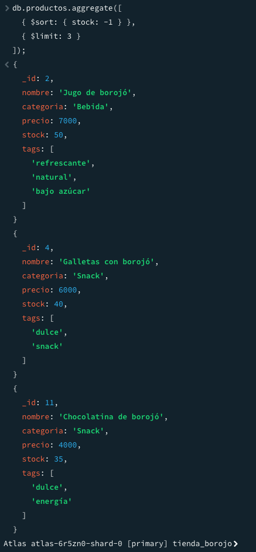

---

### 🚀 Funciones definidas en `system.js`

1. Definir una función `calcularDescuento(precio, porcentaje)` que devuelva el precio con descuento aplicado.
```js
db.system.js.insertOne({
  _id: "calcularDescuento",
  value: new Code("function(precio, porcentaje) { return precio - (precio * (porcentaje / 100)); }")
});

const f1 = db.system.js.findOne({ _id: "calcularDescuento" });
const calcularDescuento = new Function('return ' + f1.value.code)();
print(calcularDescuento(10000, 20)); // 8000
```
2. Definir una función `clienteActivo(idCliente)` que devuelva `true` si el cliente tiene más de 3 compras registradas.
```js
db.system.js.insertOne({
  _id: "clienteActivo",
  value: new Code("function(idCliente) { const cliente = db.clientes.findOne({ _id: idCliente }); return cliente && cliente.compras.length > 3; }")
});

const f2 = db.system.js.findOne({ _id: "clienteActivo" });
const clienteActivo = new Function('return ' + f2.value.code)();
clienteActivo(6); // true 
```
3. Definir una función `verificarStock(productoId, cantidadDeseada)` que retorne si hay suficiente stock.
```js
db.system.js.insertOne({
  _id: "verificarStock",
  value: new Code("function(productoId, cantidadDeseada) { const producto = db.productos.findOne({ _id: productoId }); return producto && producto.stock >= cantidadDeseada; }")
});

const f3 = db.system.js.findOne({ _id: "verificarStock" });
const verificarStock = new Function('return ' + f3.value.code)();
verificarStock(1, 5); // true
```

---

### 🚀 Transacciones

1. Simular una venta:
    a. Descontar del stock del producto
    b. Insertar la venta en la colección `ventas`
    Todo dentro de una transacción.
```js
session = db.getMongo().startSession();
const dbSession = session.getDatabase("tienda_borojo");
session.startTransaction();

try {
  // a. Descontar del stock del producto
  dbSession.productos.updateOne(
    { _id: 1 },
    { $inc: { stock: -1 } }
  );
  // b. Insertar la venta en la colección `ventas`
  dbSession.ventas.insertOne({
    _id:11,
    clienteId: 1,
    productos: [{ productoId: 1, cantidad: 1 }],
    fecha: new Date(),
    total: 5000
  });
  session.commitTransaction();
} catch (error) {
  session.abortTransaction();
  print("Error en la transacción:", error);
} finally {
  session.endSession();
}
/// Resultado de Transacciones
```
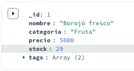
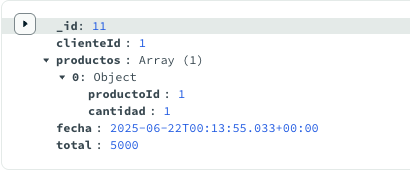

2. Simular la entrada de nuevo inventario:
    a. Insertar un documento en `inventario`
    b. Aumentar el stock del producto correspondiente
    Todo dentro de una transacción.
```js
session2 = db.getMongo().startSession();
const dbSession2 = session2.getDatabase("tienda_borojo");
session2.startTransaction();

try{
// a. Insertar un documento en `inventario` 
  dbSession2.inventario.insertOne({
    _id: 11,
    productoId: 11,
    lote: "L0011",
    cantidad: 50,
    entrada: new Date()
  });
// b. Aumentar el stock del producto correspondiente
  dbSession2.productos.updateOne({ _id: 11 },
    { $inc: { stock: 50 } }
  );
  session2.commitTransaction();
} catch (error) {
  session2.abortTransaction();
  print("Error en la transacción:", error);
}finally {
  session2.endSession();
}
  /// Resultado de Transacciones
```
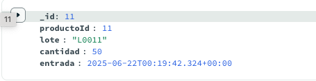


3. Hacer una operación de devolución:
    a. Aumentar el stock
    b. Eliminar la venta correspondiente
```js
session3 = db.getMongo().startSession();
const dbSession3 = session3.getDatabase("tienda_borojo");
session3.startTransaction();

try {
  // a. Aumentar el stock del producto
  dbSession3.productos.updateOne(
    { _id: 1 },
    { $inc: { stock: 1 } }
  );
  // b. Eliminar la venta correspondiente
  dbSession3.ventas.deleteOne({ _id: 11 });
  session3.commitTransaction();
} catch (error) {
  session3.abortTransaction();
  print("Error en la transacción:", error);
} finally {
  session3.endSession();
}
/// Resultado de Transacciones
```
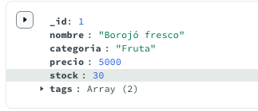

`el siguiente resultado es la eliminacion de la venta con _id:11`

---

### 🚀 Indexación

1. Crear un índice en el campo `nombre` de `productos` para mejorar búsquedas por nombre.
```js
db.productos.createIndex({nombre:1})
db.productos.getIndexes()
[
  { v: 2, key: { _id: 1 }, name: '_id_' },
  { v: 2, key: { nombre: 1 }, name: 'nombre_1' }
]
db.productos.find({nombre:"Galletas con borojó"}).explain("executionStats")
/// Resultado de Indexación
```
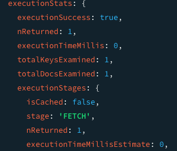

2. Crear un índice compuesto sobre `categoria` y `precio` para facilitar búsquedas filtradas por ambas condiciones.
```js
db.productos.createIndex({ categoria: 1, precio: 1 });
db.productos.getIndexes()
[
  { v: 2, key: { _id: 1 }, name: '_id_' },
  {
    v: 2,
    key: { categoria: 1, precio: 1 },
    name: 'categoria_1_precio_1'
  }
]
db.productos.find({categoria:"Fruta", precio:5000}).explain("executionStats")
/// Resultado de Indexación
```
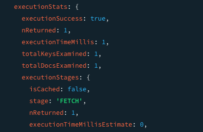

3. Crear un índice en el campo `email` de `clientes` para validaciones rápidas de duplicados.
```js
db.clientes.createIndex({ email: 1 }, { unique: true });
db.clientes.getIndexes()
[
  { v: 2, key: { _id: 1 }, name: '_id_' },
  { v: 2, key: { email: 1 }, name: 'email_1', unique: true }
]
/// Ejemplo de uso al tratar de ingresar un dato duplicado
db.clientes.insertOne({
  "_id": 12,
  "nombre": "Luiz Ramírez",
  "email": "carlos@email.com",
  "compras": [
    1
  ],
  "preferencias": [
    "natural"
  ]
})
/// Resultado del ejemplo
```
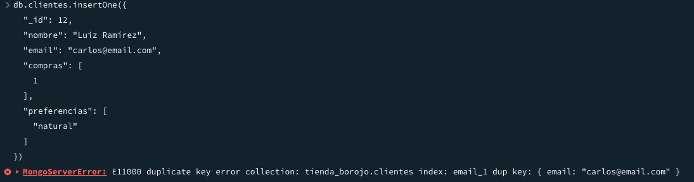

4. Usar `explain()` en una consulta para mostrar si el índice de `nombre` está siendo utilizado.
```js
db.productos.find({ nombre: "Borojó fresco" }).explain("executionStats");
/// Resultado de Explain
```
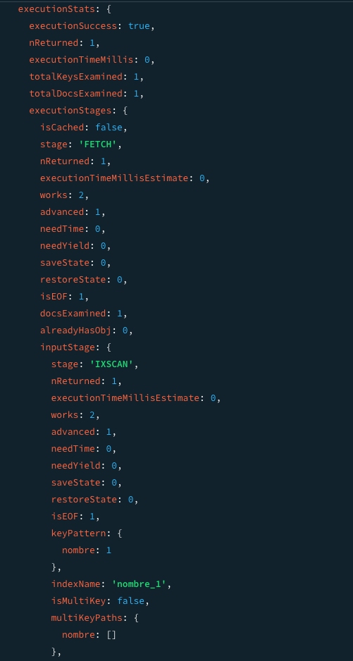